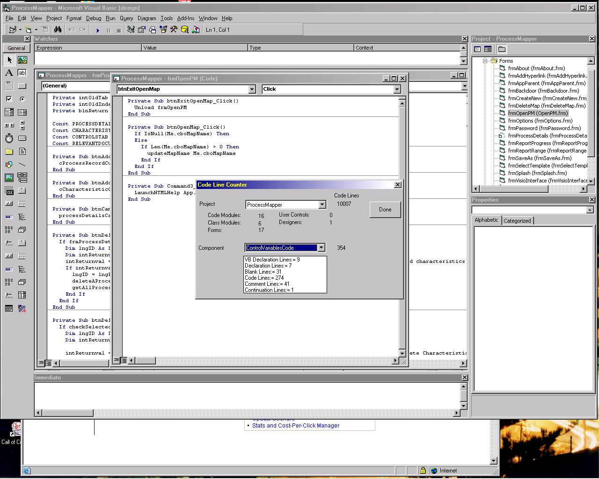



## Line Counter

### Description

A Visual Basic IDE add-in that will count the lines of code of any component of open projects. It also presents a basic analysis of both the selected project and the selected component.

To see it work just compile the "linecounter.dll" file and copy this file to your c:\Program Files\Microsoft Visual Studio\vb98 directory. You'll then need to add the line

"LineCounter.Connect=3" to your vbaddin.ini file which can be found in the windows directory and restart your VB IDE. There will be a new menu entry under "Add-Ins" called "Line Counter".
 
### More Info
 

             |
---                |---
**Submitted On**   |2003-01-02 08:24:04
**By**             |[Mark Nemtsas](https://github.com/Planet-Source-Code/PSCIndex/blob/master/ByAuthor/mark-nemtsas.md)
**Level**          |Intermediate
**User Rating**    |4.7 (14 globes from 3 users)
**Compatibility**  |VB 6\.0
**Category**       |[Debugging and Error Handling](https://github.com/Planet-Source-Code/PSCIndex/blob/master/ByCategory/debugging-and-error-handling__1-26.md)
**World**          |[Visual Basic](https://github.com/Planet-Source-Code/PSCIndex/blob/master/ByWorld/visual-basic.md)
**Archive File**   |[Line\_Count152175112003\.zip](https://github.com/Planet-Source-Code/mark-nemtsas-line-counter__1-42065/archive/master.zip)

